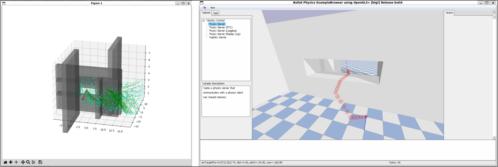
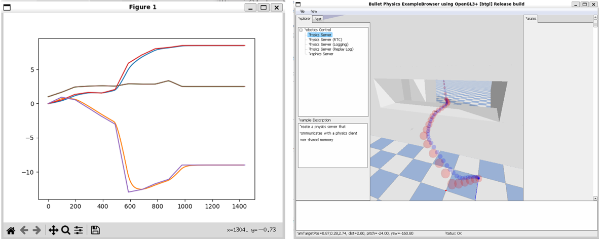

# RRT* Pathfinding and MPC Smoothing in Drone Navigation for Warehouse Inventory Assessment 

The objective of this project is to develop the path planning algorithm of a quadrotor in a warehouse simulation environment. The algorithm finds a path between a start and an end point avoiding the obstacles present in the environment.

An RRT* algorithm in 3D was implemented as a global planner to find the path from start to end position. This included a collision avoidance strategy to consider the layout of the warehouse and find the optimal path in different scenarios. Additionally, MPC was used for path smoothing and to take the physics of the drone into account. The physical feasibility of the found path is ensured, for example, by removing excessively sharp corners along the path. 

## Environments

The obstacles are known beforehand, and, for simplicity, the representation of the obstacles is limited to bounding boxes. Three environments of increasing complexity were created:

1) A warehouse with two boxes, only one of which is between the start and end positions of the drone, therefore intersecting the direct path and needing to be avoided. 

2) A warehouse with two walls creating corridor and a corner. The corridor is narrow and the drone needs to perform two sharp corners to arrive at the end position.

3) A warehouse with a wall with a gap in it and extra
corners thereafter. In this environment, the drone needs to navigate through the hole in the wall and around a corner to find the end position.

## Installation

Clone the repository [gym-pybullet-drones](https://github.com/utiasDSL/gym-pybullet-drones) into your local machine and follow its installation instructions to create and activate the conda environment.

```
git clone https://github.com/utiasDSL/gym-pybullet-drones.git
cd gym-pybullet-drones/

conda create -n drones python=3.10
conda activate drones

pip3 install --upgrade pip
pip3 install -e . # if needed, `sudo apt install build-essential` to install `gcc` and build `pybullet`
```

 Then navigate to the folder `gym_pybullet_drones` and clone or copy this repository within it. 

 ```
cd gym_pybullet_drones/
git clone https://github.com/sanzgadea/planning-and-decision-making.git

```

 The complete path of this repository would then be `gym-pybullet-drones/gym_pybullet_drones/planning-and-decision-making/`. 
 
 The folder structure should thus be as follows:

```
gym-pybullet-drones
├── gym_pybullet_drones
│   ├── assets
│   ├── control
│   ├── model
│   ├── envs
│   ├── examples
│   ├── planning-and-decision-making
│   │   ├── assets
│   │   ├── Environments
│   │   ├── planning
│   │   ├── plotting
│   │   ├── .gitignore
│   │   ├── README.md
│   │   ├── pid_rrt.py
│   │   └── rrt_mp.py
│   ├── utils
│   └── __init__.py
├── tests
├── CITATION.cff
├── LICENSE
├── README.md
├── build_project.sh
├── pypi_description.md
├── pyproject.toml
└── .gitignore
```

Additionally, install in the drones conda environment the following packages:

```
conda activate drones
conda install cvxpy
conda install tqdm
```

## Basic Usage

To run the RRT* path planning algorithm and the simulation just run the file `pid_rrt.py`. 

```
cd planning-and-decision-making/
python3 pid_rrt.py
```


A graph will pop after it has completed running with the searched tree shown in green and a path, if found, shown in red. After the graph is closed, the simulation is shown, where the drone will follow the found path using a PID controller. One out of every 20 waypoints of the path are shown in the simulation with red spheres, which the drone follows using the PID controller.



Additionally, MPC can be run using the trajectory generated by RRT* and taking the physics of the drone with the full equations of motion into account. The result is a smoother path shown in the image below in blue.
To run the Model Predictive Control algorithm, run the file `rrt_mpc.py`. 

```
python3 rrt_mpc.py
```




## Choice of Environment

To choose a different environment, among the three available, go into either `pid_rrt.py`, or `rrt_mpc.py`, and modify the variable `case`, located at the very end of the file inside of the main block. The variable can be set to one of the three integer options `1`, `2` or `3`. Each of the three environments has a different obstacle lay-out.


